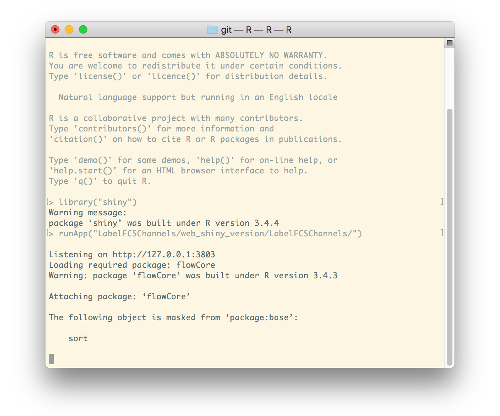
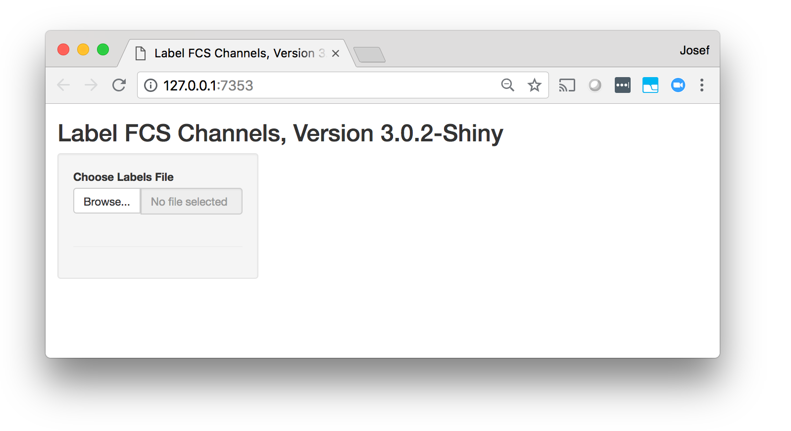
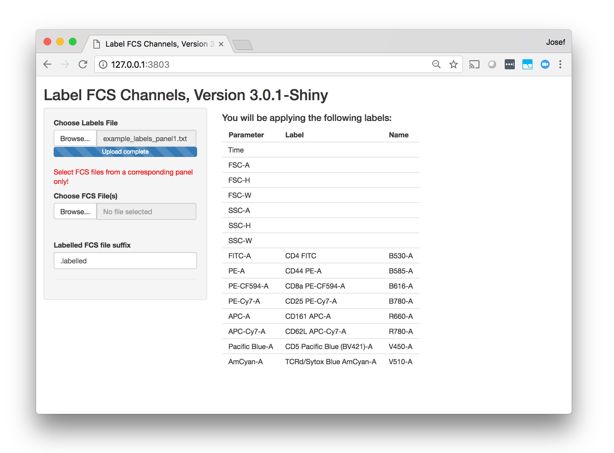
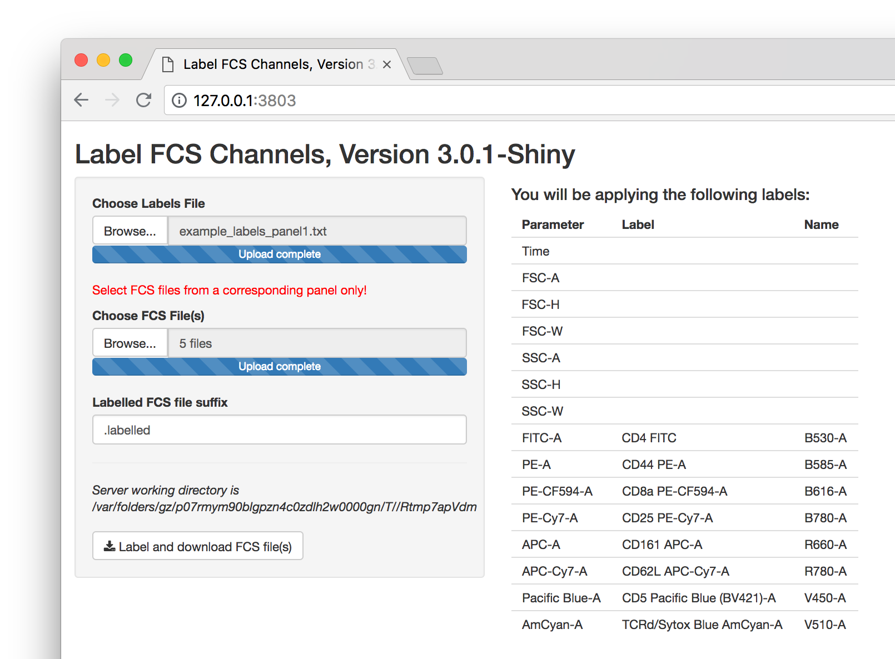

# Label FCS Channels Version 3.0.1

**Compatibility note** Version 3.0.1 of this tool is not compatible with the flowCore 1.46.0 and newer package. This will be resolved soon in a version 3.0.2. Please use flowCore 1.44.2 or older.

The *Label FCS Channels* tool allows you to label channels (parameters) in an FCS 2.0, FCS 3.0 or FCS 3.1 list mode data file. Labelling means adding or rewriting the values of parameter names, i.e., values of the $PnS and $PnN FCS keywords ([see FCS format](http://www.ncbi.nlm.nih.gov/pubmed/19937951)) based on externally supplied labels and names. Rewriting $PnN keyword values is a new functionality that has been added in version 3.0 of this tool. Labels and names are provided in text file templates (see below). This tool is intended to be used post-acquisition to standardize the FCS channel description of IMPC acquired flow cytometry data, but can be applied on other FCS data files as well.

There are two kinds of parameter names in FCS data files:

1. Short names (values of **$PnN** keywords). Those are required to be present and unique among all parameters within the FCS data file as they are also used for parameter indexing purposes (e.g., in the spillover matrix for proper compensation). Historically, those have been "useless" identifiers, such as FL1-A, FL2-A, FL3-A, etc. While this tool can be used to assign any $PnN name, you may want to consider following Mario Roederer's proposal for unified flow cytometer parameter naming ([Cytometry A, 2015, 87(8), 689-691](http://onlinelibrary.wiley.com/doi/10.1002/cyto.a.22670/abstract)), which reveals some additional information about the cytometer configuration, such as the laser type and the peak filer wavelength for each of the FCS parameters.
1. Long names (values of **$PnS** keywords). Those are supposed to be more meaningful descriptions (labels). We intend to fill out the marker and fluorochrome information in $PnS keyword values.

## Getting Started

These instructions will get you a copy of the project up and running on your local machine for development and testing purposes. See deployment for notes on how to deploy the project on a live system.

### Prerequisites

This tools requires *R 3.2.0* and the *flowCore* library, version 1.34.0. Other versions of R and flowCore may also work but have not been tested. In addition, the web-based version of the tool requires the *shiny* library (tested with version 0.12.1), and the non-web-based version of the tool requires the *svDialogs* library (tested with version 0.9-57) if used in an interactive mode (see Usage below).

### Installation

1. Download and install R, follow instructions at [http://www.r-project.org/](http://www.r-project.org/)
1. Install the required R libraries (flowCore, svDialogs and shiny). To install these libraries, start
your R console and enter:

```R
source("http://bioconductor.org/biocLite.R")
biocLite("flowCore")
biocLite("svDialogs")
biocLite("shiny")
```

*Note*: It is recommended to install all the libraries although svDialogs is only required for the non-web version in interactive mode, and shiny is only required for the web version of the tool.

Clone or download and extract a zip with this project.

## Usage

There are two versions of the *Label FCS Channels* tool: a web-based version and a non-web-based version. They both include the same functionality, but they are used differently. Most users will likely prefer the web-based version as prettier and easier to use. The non-web-based option may be more suitable for a high-throughput setting.

### Web-based Version, Interactive Mode

Start the tool as follows:

1. Open your R console (R 3.2.0 recommended, libraries flowCore and shiny have to be installed, see Installation section above for instruction on how to install R and the required libraries)
1. Enter
```R
library("shiny")
runApp("path/to/Label FCS Channels/web_shiny_version/LabelFCSChannels")
```
where **path/to/Label FCS Channels/web_shiny_version/LabelFCSChannels** is the actual path to the directory with the web version of the Label FCS Channels tool. There are two files in this directory, *server.R* and *ui.R*. The exact location depends on where you have extracted the provided LabelFCSChannels.zip file during installation. This will start the tool and print a local URL that it is listening on as shown below.



In this example, the tool is listening on http://127.0.0.1:3803. Your URL address may be different. With most computers, the tool will automatically open your default web browser on the corresponding page. If that does not happen, open your web browser and copy and paste the address to the address bar. You should see a page similar to the one shown below. Now you can start using the tool.



1. Choose your labels file by clicking on the Browse... button and selecting your file in the file open dialogue. Label files are panel-specific templates of how FCS channels will be described. Selecting a labels file will “upload it” and show you the labels that you are going to apply.
1. The page will change to include additional controls as shown below.
1. Similary, select one or more FCS files from a panel that corresponds to the previously selected labels. You can select all files in a directory by clicking on the first file, holding down the Shift key and then clicking on the last file. Selecting over 300 MB of FCS files is not recommended.
1. The “Labelled FCS file suffix” (.labelled by default) determines how labelled FCS files will be named. For example, a labelled version of file P1x12.fcs will be named P1x12.labelled.fcs if the default suffix is used. The .fcs file extension is always added. You can delete the value in the “Labelled FCS file suffix” text field if you want to keep the original file names. This will not rewrite your input files.
1. The nature of a web-based tool implies that the tool cannot delete all temporary files used during its operation. Therefore, we are displaying a temporary directory where data processing is taking place. On most computers, these directories will eventually get deleted automatically by the operating system, but if you are concerned about the space on your drive, you may want to manually delete the contents of this directory after you finish working with the tool.
1. Finally, click on the “Label and download FCS file(s)” button. If you have selected only a single FCS file to be labelled, the tool will send a labelled FCS file to your web browser. Some browsers will give you the option to either open or save the file, and you will either be prompted for the location where to save the files, or the file will be placed to your “Downloads” by default. If you have selected more than one FCS file to be labelled, the tool will send you a ZIP file with labelled FCS files. Consequently, you will need to unzip the files once saved from your browser. In addition, please note that labelling and zipping the result files may take some time. Based on our testing, labelling and zipping 5 FCS files (150 MB of data) took about 10 to 20 seconds depending on which computer was used. Please exercise patience and wait for the labelling and zipping to finish if you are planning to submit a larger amount of files at once.
1. In order to label additional files, simply change the labels file (upload new labels file), upload new FCS files and click on the “Label and download FCS file(s)” button again.
1. Once you are finished, shut down the tool by pressing Ctrl+C in your R console (or press the stop button or just close R). The browser window will turn grey. You may also close the browser window. Note that simply closing the browser window will not shut down the tool within R.





## Author

**Josef Spidlen**

## License

This tools is licensed under Apache License Version 2.0, see the [LICENSE](LICENSE) for details.

